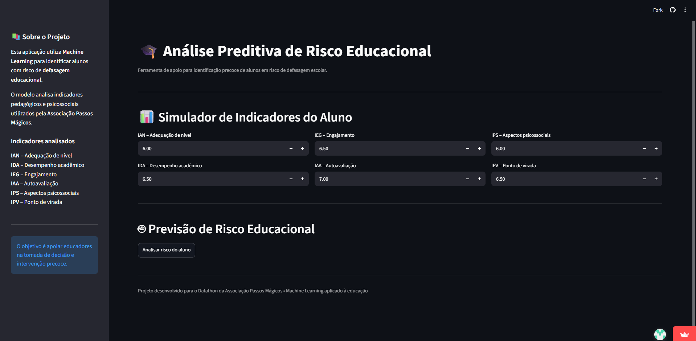
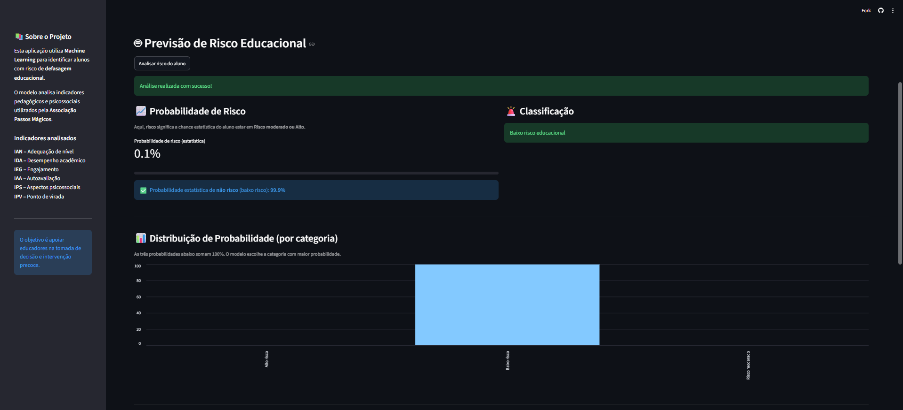
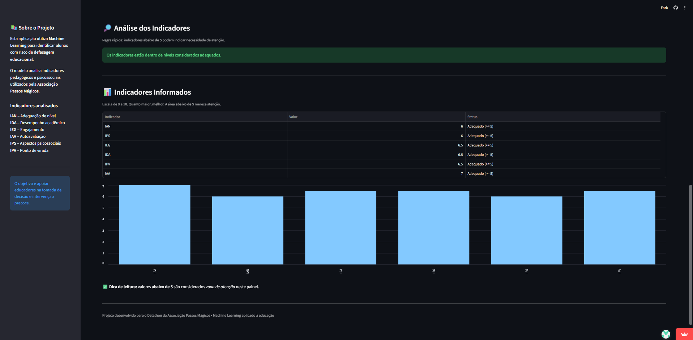

# 🎓 Análise Preditiva de Risco Educacional

Aplicação desenvolvida em **Python** e **Streamlit** para apoiar a **identificação precoce de alunos em risco de defasagem educacional**, utilizando técnicas de **Machine Learning** combinadas a **regras pedagógicas preventivas**.

O projeto foi desenvolvido no contexto do **Datathon da Associação Passos Mágicos**, com foco na utilização de dados educacionais para apoiar a tomada de decisão e possibilitar intervenções pedagógicas preventivas.

🔗 **[Acessar aplicação online](https://previsao-de-risco-educacional.streamlit.app/)**

---

## 🎯 Objetivo do Projeto

A defasagem educacional é um fenômeno multifatorial, influenciado por aspectos acadêmicos, comportamentais e psicossociais.

O objetivo deste projeto é **estimar o risco educacional de alunos antes da ocorrência de uma situação de defasagem consolidada**, utilizando indicadores pedagógicos e psicossociais.

A aplicação busca:

- identificar precocemente perfis que podem demandar acompanhamento;
- analisar fatores associados ao risco educacional;
- apoiar a definição de intervenções pedagógicas preventivas;
- apresentar os resultados de forma clara e interpretável;
- auxiliar educadores na tomada de decisão, sem substituir a avaliação humana.

> **Importante:** o resultado apresentado pela aplicação representa uma estimativa de risco e não deve ser interpretado como diagnóstico ou decisão pedagógica definitiva.

---

## 📊 Indicadores Analisados

O modelo utiliza seis indicadores considerados relevantes para a análise do perfil do aluno:

| Indicador | Descrição |
|---|---|
| **IAN** | Adequação de nível |
| **IDA** | Desempenho acadêmico |
| **IEG** | Engajamento |
| **IAA** | Autoavaliação |
| **IPS** | Aspectos psicossociais |
| **IPV** | Ponto de virada |

Esses indicadores permitem analisar diferentes dimensões do perfil do aluno antes da ocorrência da defasagem.

---

## 🧠 Construção da Variável de Risco

A variável de **risco educacional** — classificada em **baixo, moderado ou alto** — foi construída a partir da variável histórica de **defasagem (`Defas`)**, utilizada exclusivamente para a criação do rótulo durante o treinamento do modelo.

A variável `Defas` **não é utilizada como variável de entrada na aplicação**.

Essa separação foi adotada para evitar **data leakage (vazamento de informação)** e garantir que o modelo utilize apenas informações disponíveis antes da ocorrência da situação que se deseja prever.

---

## 🔎 Seleção das Variáveis

Algumas variáveis foram removidas do conjunto utilizado no treinamento por apresentarem informações diretamente relacionadas ao resultado que o modelo deveria prever.

### Variáveis excluídas

**`Defas`**  
Utilizada para construção da variável-alvo. Sua utilização como preditora resultaria em vazamento de informação.

**`risco`**  
Variável-alvo do modelo e, portanto, não pode ser utilizada como variável de entrada.

**`IPP` e `INDE`**  
Índices agregados que sintetizam outros indicadores e poderiam fornecer ao modelo informações que já representam indiretamente o risco educacional.

A exclusão dessas variáveis busca evitar que o modelo simplesmente reproduza informações já consolidadas nos dados, tornando a previsão mais coerente com o objetivo de **identificação antecipada de risco**.

---

## 🤖 Estratégia de Modelagem

O projeto utiliza uma **abordagem híbrida**, combinando Machine Learning com regras pedagógicas preventivas.

### 1. Risco Estatístico — Machine Learning

O modelo de Machine Learning estima a probabilidade de o aluno pertencer às categorias de risco.

A classificação considera as probabilidades estimadas para **risco moderado** e **alto risco**, permitindo identificar alunos que apresentam maior probabilidade de demandar acompanhamento.

### 2. Risco Moderado Preventivo — Regra Pedagógica

Além da previsão estatística, foi criada uma regra complementar para identificar situações em que existe uma **concentração de indicadores em zona de atenção**, mesmo quando o modelo estatístico não aponta um risco elevado.

O aluno pode ser classificado como **Risco Moderado Preventivo** quando apresenta:

- dois ou mais indicadores abaixo de **5,0**; ou
- três ou mais indicadores abaixo de **4,5**.

Essa abordagem busca incorporar uma perspectiva preventiva ao modelo, considerando que a presença simultânea de múltiplos sinais de fragilidade pode justificar acompanhamento mesmo quando a probabilidade estatística de risco é baixa.

---

## ⚖️ Interpretação do Risco Moderado

O resultado **Risco Moderado** pode ocorrer por dois mecanismos diferentes:

**Risco Moderado Estatístico**  
Resultado proveniente da probabilidade estimada pelo modelo de Machine Learning.

**Risco Moderado Preventivo**  
Resultado decorrente da aplicação das regras pedagógicas, quando existe concentração de indicadores em zona de atenção.

Essa distinção melhora a **transparência e explicabilidade** da aplicação e permite compreender melhor a origem da classificação apresentada.

---

## 🖥️ Aplicação

A aplicação foi desenvolvida utilizando **Streamlit** e apresenta uma interface interativa para simulação do perfil do aluno.

O usuário pode informar os valores dos seis indicadores analisados e executar a previsão.

### Interface

### Resultado da previsão

### Detalhamento do resultado

A interface apresenta:

- simulador dos indicadores do aluno;
- classificação do risco educacional;
- probabilidades estimadas pelo modelo;
- identificação dos indicadores em situação de atenção;
- diferenciação entre risco estatístico e risco preventivo.

A aplicação foi projetada para priorizar **clareza, interpretabilidade e apoio à decisão**, mantendo o educador como responsável pela avaliação e intervenção.

### 🔗 Aplicação online

**[Acessar aplicação no Streamlit](https://previsao-de-risco-educacional.streamlit.app/)**

---

## 🛠️ Tecnologias Utilizadas

- **Python**
- **Pandas**
- **Scikit-learn**
- **Joblib**
- **Streamlit**
- **Jupyter Notebook**

---

## 📂 Estrutura do Projeto

A estrutura do projeto inclui:

- `imagens/` — imagens utilizadas na documentação da aplicação;
- `app.py` — interface da aplicação desenvolvida em Streamlit;
- `predictor.py` — responsável pela utilização do modelo para realização das previsões;
- `codigo.ipynb` — notebook utilizado durante o processo de análise e desenvolvimento do modelo;
- `modelo_treinado.pkl` — modelo de Machine Learning treinado e utilizado pela aplicação;
- `basededadospm.xlsx` — base de dados utilizada no projeto;
- `requirements.txt` — dependências necessárias para execução do projeto;
- `teste.py` — arquivo utilizado para testes durante o desenvolvimento;
- `README.md` — documentação do projeto.

---

## 📌 Principais Conceitos Aplicados

Este projeto reúne conceitos de:

- **Análise de Dados**
- **Machine Learning**
- **Classificação preditiva**
- **Engenharia e seleção de variáveis**
- **Prevenção de data leakage**
- **Tratamento e interpretação de dados**
- **Modelagem preditiva**
- **Regras de negócio**
- **Explicabilidade de modelos**
- **Desenvolvimento de aplicações com Streamlit**
- **Deploy de aplicações de Data Science**

---

## 🌱 Considerações Finais

O projeto demonstra uma aplicação prática de **Machine Learning no contexto educacional**, combinando análise estatística e conhecimento de negócio para apoiar a identificação antecipada de situações de risco.

A abordagem busca equilibrar:

- **rigor técnico**;
- **prevenção**;
- **interpretabilidade**;
- **transparência**;
- **aplicabilidade prática**.

O modelo não tem como objetivo substituir a avaliação dos profissionais da educação, mas fornecer **informações analíticas que possam apoiar decisões e intervenções preventivas**.
